STUDENT INFORMATION:
Name: Hoàng Xuân Dũng
Student ID: ITITWE22009
Class: IT093IU

COMPLETED EXERCISES:
[x] Exercise 1: Set Up And Display
[x] Exercise 2: Create Operation
[x] Exercise 3: Update Operation
[x] Exercise 4: Delete Operation
[x] Exercise 5: Search Functionality
[x] Exercise 6: Validation Enhancement
[x] Exercise 7: Pagination
[x] Bonus 1: CSV Export
[x] Bonus 2: Sortable Columns

# 🧾 EX1 – Report: `list_students.jsp`

## DEMO

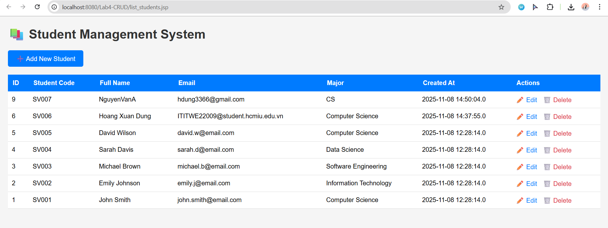

## 1️⃣ Purpose and Scope
**Goal:**  
Display a table of all students from the MySQL table **`students`** (database: `student_management`), including **Add**, **Edit**, and **Delete** links.

**Assessed Skills:**
- Correct JSP directive and encoding setup  
- JDBC connection and SQL `SELECT` execution  
- Looping through `ResultSet` and generating HTML table  
- Navigation between JSP pages (Add/Edit/Delete)

---

## 2️⃣ File Location and How the Server Finds It

### 📁 Physical location
```
src/main/webapp/list_students.jsp
```

### 🌐 Runtime URL (Tomcat)
```
http://localhost:8080/Lab4-CRUD/list_students.jsp
```

Tomcat automatically maps JSP files inside `src/main/webapp` to URL paths matching their filenames.  
➡️ No `web.xml` configuration or servlet mapping is required for static JSP files.

---

## 3️⃣ JSP Directive and Import Explanation

```jsp
<%@ page contentType="text/html; charset=UTF-8"
         pageEncoding="UTF-8"
         import="java.sql.*, db.dbConnection" %>
```

| Attribute | Purpose |
|------------|----------|
| `contentType="text/html; charset=UTF-8"` | Ensures the response is HTML with UTF-8 encoding. |
| `pageEncoding="UTF-8"` | Ensures the JSP file itself is read using UTF-8 encoding (avoids Vietnamese character corruption). |
| `import="java.sql.*, db.dbConnection"` | Allows use of JDBC classes (`Connection`, `PreparedStatement`, `ResultSet`) and the shared connection class `dbConnection`. |

> ⚠️ Important: Attributes must be separated by spaces — otherwise Tomcat (Jasper) throws an error.

---

## 4️⃣ Code Flow (Request → DB → HTML)

### 🔁 Simplified JSP Flow

```jsp
<%@ page contentType="text/html; charset=UTF-8" pageEncoding="UTF-8" import="java.sql.*, db.dbConnection" %>
<!DOCTYPE html>
<html>
<body>

<!-- (A) Read messages from query parameters -->
<%
String msg = request.getParameter("msg");
String err = request.getParameter("error");
%>

<!-- (B) Navigation button -->
<a href="add_student.jsp">➕ Add New Student</a>

<!-- (C) Table header -->
<table> ... </table>

<!-- (D) Connect to database and execute SELECT -->
<%
try (Connection conn = dbConnection.getConnection();
     PreparedStatement ps = conn.prepareStatement("SELECT * FROM students ORDER BY id DESC");
     ResultSet rs = ps.executeQuery()) {

  while (rs.next()) {
%>
    <tr>
      <td><%= rs.getInt("id") %></td>
      <td><%= rs.getString("student_code") %></td>
      <td><%= rs.getString("full_name") %></td>
      <td><%= rs.getString("email") %></td>
      <td><%= rs.getString("major") %></td>
      <td><%= rs.getTimestamp("created_at") %></td>
      <td>
        <a href="edit_student.jsp?id=<%= rs.getInt("id") %>">Edit</a> |
        <a href="delete_student.jsp?id=<%= rs.getInt("id") %>"
           onclick="return confirm('Are you sure?');">Delete</a>
      </td>
    </tr>
<%
  }
} catch (Exception e) {
  out.println("<tr><td colspan='7'>Error: " + e.getMessage() + "</td></tr>");
}
%>

</body>
</html>
```

### 🧠 Step-by-step explanation

| Step | Description |
|------|--------------|
| **(A)** | Reads `msg` and `error` query params to show feedback banners (e.g., “Added successfully”). |
| **(B)** | Displays navigation link to `add_student.jsp`. |
| **(C)** | Builds table headers for `ID`, `Student Code`, `Full Name`, etc. |
| **(D)** | Calls `dbConnection.getConnection()` → internally loads `com.mysql.cj.jdbc.Driver` → `DriverManager.getConnection(...)`. |
| **(E)** | Executes `SELECT * FROM students ORDER BY id DESC` using `PreparedStatement`. |
| **(F)** | Loops through `ResultSet` to print `<tr>` rows for each student. |
| **(G)** | Appends **Edit** and **Delete** links, passing `id` via query string. |
| **(H)** | Catches any exception, printing an inline error message within the table. |

---

## 5️⃣ How Tomcat Resolves Navigation Links

| Link | File Mapped To | Function |
|------|----------------|-----------|
| `href="add_student.jsp"` | `/webapp/add_student.jsp` | Opens Add form |
| `href="edit_student.jsp?id=..."` | `/webapp/edit_student.jsp` | Opens Edit form, passing `id` |
| `href="delete_student.jsp?id=..."` | `/webapp/delete_student.jsp` | Calls Delete logic (EX4) |

If the context path changes, use:
```jsp
<a href="${pageContext.request.contextPath}/add_student.jsp">Add Student</a>
```

---

## 6️⃣ Visual Flow Diagram

```
Browser GET /Lab4-CRUD/list_students.jsp
   │
   ├─ JSP directive: setup encoding + import JDBC + dbConnection
   ├─ Read ?msg & ?error → show feedback banners
   ├─ Open DB connection via dbConnection.getConnection()
   │    └─ DriverManager.getConnection("jdbc:mysql://...","root","****")
   ├─ Run SELECT * FROM students ORDER BY id DESC
   ├─ Loop ResultSet → output <tr> rows
   └─ Render links (Add/Edit/Delete)
Response → Browser renders full HTML table
```

---

## 7️⃣ Common Issues and Fixes

| Problem | Cause | Solution |
|----------|--------|----------|
| `HTTP 500 – JSP attribute name error` | Missing whitespace between directive attributes | Fix: `<%@ page contentType="..." pageEncoding="..." %>` |
| `Access denied for user 'root'@'localhost'` | Wrong DB credentials | Update `dbConnection.java` with correct username/password |
| `ClassNotFoundException: com.mysql.cj.jdbc.Driver` | Missing MySQL Connector | Add dependency `mysql-connector-j` in `pom.xml` |
| Empty table | DB has no rows | Run `SELECT * FROM students;` in MySQL Workbench |

---

## 8️⃣ Why Use `PreparedStatement`
Even though EX1 doesn’t have parameters, using `PreparedStatement`:
- Prevents SQL injection when parameters appear in later exercises (EX2–EX4).  
- Improves readability and consistency.  
- Allows database-side statement caching for performance.

---

## 9️⃣ What the Grader Should See
✅ Accessing  
```
http://localhost:8080/Lab4-CRUD/list_students.jsp
```  
shows:
- 5 sample student records  
- “Add New Student” button  
- “Edit” and “Delete” links per row  
- Proper UTF-8 display  
- No runtime errors  
- Newest records appear first (`ORDER BY id DESC`)

---

## 🔟 Quick Reference

| Item | Value |
|------|-------|
| **Project view** | Web Pages → `list_students.jsp` |
| **On disk (Maven)** | `src/main/webapp/list_students.jsp` |
| **URL (Tomcat)** | `http://localhost:8080/Lab4-CRUD/list_students.jsp` |

---


### ✅ Expected Output
| ID | Student Code |   Full Name  |       Email       |       Major      | Created At |    Actions    |
|----|--------------|--------------|-------------------|------------------|------------|---------------|
| 5  | SV005        | David Wilson | david.w@email.com | Computer Science | .......... | Edit | Delete |
| 4  | SV004        | Sarah Davis  | sarah.d@email.com |   Data Science   | ... .......| Edit | Delete |
| ... | ... | ... | ... | ... | ... | ... |

---

> 💡 Next step: create **EX2 report (add_student.jsp + process_add.jsp)** following the same structure — purpose, mapping, directive explanation, request→DB→response flow, and code walkthrough.
---
# 🧾 EX2 – Report: `add_student.jsp` + `process_add.jsp`

## DEMO

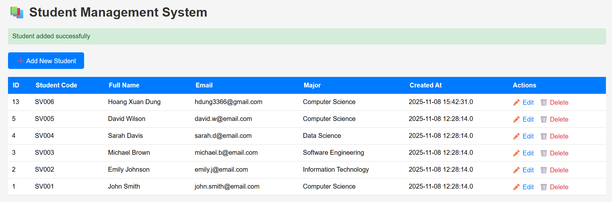

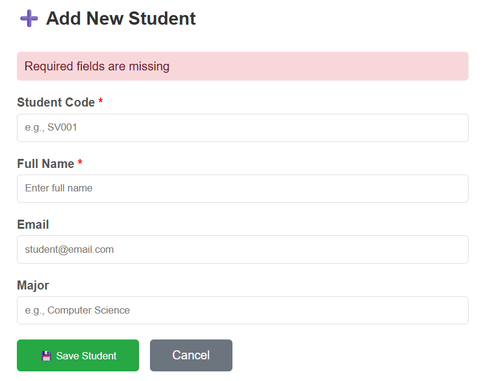


## 1️⃣ Purpose and User Story
- From **`list_students.jsp`**, the user clicks **Add New Student**.  
- Show a form (`add_student.jsp`).  
- Validate input. If valid → **INSERT** a new row via `process_add.jsp` → redirect back to list with a success banner.  
- If invalid or duplicate → show an error and guide the user.

---

## 2️⃣ How the server finds the pages (routing)
- On the list page, the “Add” button is an anchor:  
  ```html
  <a href="add_student.jsp">➕ Add New Student</a>
  ```
  ➜ Browser sends **GET** to `/Lab4-CRUD/add_student.jsp` (Tomcat maps to `src/main/webapp/add_student.jsp`).

- The form in `add_student.jsp` posts to `process_add.jsp`:  
  ```jsp
  <form action="process_add.jsp" method="post" accept-charset="UTF-8">
  ```
  ➜ Browser sends **POST** to `/Lab4-CRUD/process_add.jsp`.

- **Cancel** is just an anchor back to the list (no server-side action):  
  ```html
  <a class="btn" href="list_students.jsp">Cancel</a>
  ```

---

## 3️⃣ `add_student.jsp` — What runs when you click “Add Student”
**Code skeleton (cleaned and annotated):**
```jsp
<%@ page contentType="text/html; charset=UTF-8" pageEncoding="UTF-8" %>
<!DOCTYPE html>
<html>
<head> ... CSS omitted ... </head>
<body>
  <div class="wrap">
    <h2>➕ Add Student</h2>

    <%-- (A) Show error banner if a previous validation failed --%>
    <% String error = request.getParameter("error"); 
       if (error != null) { %>
       <div class="err"><%= error %></div>
    <% } %>

    <%-- (B) Main form. User POSTs data to process_add.jsp --%>
    <form action="process_add.jsp" method="post" accept-charset="UTF-8">
      <label>Student Code *</label>
      <input name="student_code" required>

      <label>Full Name *</label>
      <input name="full_name" required>

      <div class="row">
        <div>
          <label>Email</label>
          <input name="email" type="email" placeholder="name@example.com">
        </div>
        <div>
          <label>Major</label>
          <input name="major" placeholder="Computer Science">
        </div>
      </div>

      <div class="actions">
        <button class="btn primary" type="submit">Save</button>
        <%-- (C) Cancel = simple link, no server-side code executes --%>
        <a class="btn" href="list_students.jsp">Cancel</a>
      </div>
    </form>
  </div>
</body>
</html>
```

### Flow when **Add Student** is clicked on the list page
1) Browser navigates to `add_student.jsp` (GET).  
2) JSP evaluates section **(A)**: if the previous attempt failed, `?error=...` will exist and the banner appears.  
3) User fills **Student Code** and **Full Name** (required).  
4) Clicking **Save** triggers **(B)**: the browser sends a **POST** to `process_add.jsp`.  
5) Clicking **Cancel** triggers **(C)**: just navigates back to `list_students.jsp` (no DB/query at all).

---

## 4️⃣ `process_add.jsp` — Which code runs on submit?

**Canonical implementation (with validation & duplicate handling):**
```jsp
<%@ page contentType="text/html; charset=UTF-8" pageEncoding="UTF-8" import="java.sql.*" %>
<%
  request.setCharacterEncoding("UTF-8");

  // (1) Read form fields
  String code  = request.getParameter("student_code");
  String name  = request.getParameter("full_name");
  String email = request.getParameter("email");
  String major = request.getParameter("major");

  // (2) Server-side validation: required fields
  if (code == null || code.isEmpty() || name == null || name.isEmpty()) {
    response.sendRedirect("add_student.jsp?error=Student Code and Full Name are required");
    return;
  }
  // (3) Optional: email format validation
  if (email != null && !email.isEmpty() && !email.matches("^[A-Za-z0-9+_.-]+@(.+)$")) {
    response.sendRedirect("add_student.jsp?error=Invalid email format");
    return;
  }

  // (4) Insert using shared dbConnection
  try (Connection conn = db.dbConnection.getConnection();
       PreparedStatement ps = conn.prepareStatement(
           "INSERT INTO students(student_code, full_name, email, major) VALUES (?,?,?,?)")) {

    ps.setString(1, code.trim());
    ps.setString(2, name.trim());
    ps.setString(3, (email == null || email.isEmpty()) ? null : email.trim());
    ps.setString(4, (major == null || major.isEmpty()) ? null : major.trim());
    ps.executeUpdate();

    // (5) On success → back to list with success message
    response.sendRedirect("list_students.jsp?msg=Added successfully");
  } catch (SQLException e) {
    // (6) Handle unique constraint (duplicate student_code) or other SQL errors
    String msg = e.getMessage();
    if (msg != null && msg.toLowerCase().contains("duplicate")) {
      response.sendRedirect("add_student.jsp?error=Student Code already exists");
    } else {
      response.sendRedirect("list_students.jsp?error=" + msg.replaceAll("\s+","%20"));
    }
  } catch (Exception e) {
    // (7) Generic error
    response.sendRedirect("list_students.jsp?error=" + e.getMessage().replaceAll("\s+","%20"));
  }
%>
```

### Detailed code-flow breakdown
- **On submit (Save)**  
  → Steps **(1)–(7)** execute in order.
  - **(1)** Read the posted fields by name.  
  - **(2)** Validate required fields (**Student Code**, **Full Name**). If either missing → **redirect back to form** with `?error=...` (the banner in `add_student.jsp` shows it).  
  - **(3)** Validate email format (optional but recommended). If invalid → redirect back with error.  
  - **(4)** Open a DB connection via `dbConnection.getConnection()` and run an **INSERT** using `PreparedStatement` to prevent SQL injection.  
  - **(5)** If INSERT succeeds → redirect to `list_students.jsp?msg=Added successfully`. The list page shows a green success banner and the new record appears at the top (because `ORDER BY id DESC`).  
  - **(6)** If a **duplicate** key happens (e.g., `student_code` is UNIQUE and already exists), we check the exception message and redirect to `add_student.jsp?error=Student Code already exists`. The user sees a red error box and can edit the input.  
  - **(7)** Any other exception is redirected to the list with an error banner.

- **On cancel**  
  → No code in `process_add.jsp` runs. The anchor navigates directly to `list_students.jsp`.

---

## 5️⃣ What happens in each user scenario?

| Scenario | Which file runs | Which lines run | Result |
|---------|------------------|------------------|--------|
| Click **Add New Student** on the list page | `add_student.jsp` (GET) | Section **(A)** shows previous error (if any). The HTML form in **(B)** renders. | Form appears. |
| Click **Save** with **missing required fields** | `process_add.jsp` (POST) | Validation **(2)** triggers: `response.sendRedirect("add_student.jsp?error=...")` | Back to form, red banner shown. |
| Click **Save** with **invalid email** | `process_add.jsp` (POST) | Validation **(3)** triggers → redirect back with error | Back to form, red banner shown. |
| Click **Save** with **valid, non-duplicate** data | `process_add.jsp` (POST) | DB block **(4)** does `INSERT`, then **(5)** redirect to list `?msg=Added successfully` | List shows green banner + new row at top. |
| Click **Save** with **duplicate `student_code`** | `process_add.jsp` (POST) | Catch block **(6)** detects “duplicate” → redirect to `add_student.jsp?error=Student Code already exists` | Back to form with red banner; user changes code. |
| Click **Cancel** | (No server code) | Only the **anchor** executes (client-side navigation) | Return to `list_students.jsp`. |

---

## 6️⃣ Sequence diagrams (high-level)

### (a) Normal happy path
```
List → [click Add] → add_student.jsp (GET)
   → [fill form + Save] → process_add.jsp (POST)
      → validate OK → INSERT → redirect list_students.jsp?msg=Added successfully
         → List reloads → shows success banner + new row
```

### (b) Missing fields / invalid email
```
List → [Add] → add_student.jsp → [Save with missing/invalid]
   → process_add.jsp → validation fails → redirect add_student.jsp?error=...
      → Form reloads with red banner
```

### (c) Duplicate student_code
```
List → [Add] → add_student.jsp → [Save duplicate code]
   → process_add.jsp → SQLException "duplicate" → redirect add_student.jsp?error=Student Code already exists
      → User edits → Save again → success path
```

### (d) Cancel
```
add_student.jsp → [Cancel anchor] → list_students.jsp
(no server-side validation/insert occurs)
```

---

## 7️⃣ Common pitfalls (and how this code avoids them)
- **Relying on client-side `required` only** → We always perform **server-side** validation in `process_add.jsp`.  
- **String concatenation SQL** → We use `PreparedStatement` to eliminate SQL injection risks.  
- **Driver not found / wrong credentials** → Shared `dbConnection.getConnection()` centralizes driver and credentials, so we fix in one place.  
- **Not closing resources** → Try-with-resources ensures `Connection`/`PreparedStatement` are closed even on exceptions.  
- **Blank screen after submit** → We always **redirect** to a visible page (form or list) with a clear banner message.  

---

## 8️⃣ Acceptance checklist (what your teacher sees)
- Clicking **Add** navigates to a clean, UTF-8 form page.  
- Submitting incomplete/invalid inputs correctly returns to the form with a clear **error** banner.  
- Submitting valid data inserts a row and returns to the list with a **success** banner; new row is visible on top.  
- Duplicate `student_code` is handled gracefully with a **specific error** back on the form.  
- **Cancel** takes the user back to the list without any changes to the database.

---

# 🧾 EX3 – Report: `edit_student.jsp` + `process_edit.jsp`

## DEMO


---

## 1️⃣ Purpose and User Story
From the **student list** page, a user clicks **Edit** on a specific row.  
The app must:
- Read the `id` from the query string.
- Load the current data for that `id` and **prefill** a form (`edit_student.jsp`).
- Validate inputs, then **UPDATE** the row via `process_edit.jsp`.
- Redirect with banners for success or error cases.

> In your implementation, `student_code` is **read-only** on the edit form (cannot be changed), while **full_name**, **email**, and **major** can be updated.

---

## 2️⃣ Routing / How the server finds pages

### On the list page (`list_students.jsp`)
Each row renders an **Edit** link that carries the primary key:
```jsp
<a href="edit_student.jsp?id=<%= rs.getInt("id") %>">✏️ Edit</a>
```
➡️ Browser does **GET** `/Lab4-CRUD/edit_student.jsp?id=123`.

### On the edit page (`edit_student.jsp`)
The **form** posts to the **processor**:
```jsp
<form action="process_edit.jsp" method="post" accept-charset="UTF-8">
  <input type="hidden" name="id" value="<%= studentId %>">
  ...
</form>
```
➡️ Browser does **POST** `/Lab4-CRUD/process_edit.jsp` on Save.

### Cancel
Just a link back to the list (no server-side work):
```html
<a href="list_students.jsp" class="btn-cancel">Cancel</a>
```

---

## 3️⃣ `edit_student.jsp` – What it does when you click “Edit”

**Key responsibilities:**
1) Validate the presence/format of `id`.  
2) Load the record by `id`.  
3) Prefill the form fields.  
4) Render an **Update** button that posts to `process_edit.jsp`.  
5) Offer a **Cancel** link back to the list.

**Annotated skeleton:**

```jsp
<%@ page contentType="text/html; charset=UTF-8" pageEncoding="UTF-8" import="java.sql.*, db.dbConnection" %>
<%
  // (A) Validate id in query string
  String idParam = request.getParameter("id");
  if (idParam == null || idParam.trim().isEmpty()) {
    response.sendRedirect("list_students.jsp?error=Invalid student ID"); return;
  }
  int studentId;
  try { studentId = Integer.parseInt(idParam); }
  catch (NumberFormatException e) {
    response.sendRedirect("list_students.jsp?error=Invalid ID format"); return;
  }

  // (B) Fetch current values from DB
  String studentCode="", fullName="", email="", major="";
  try (Connection conn = dbConnection.getConnection();
       PreparedStatement ps = conn.prepareStatement("SELECT * FROM students WHERE id=?")) {
    ps.setInt(1, studentId);
    try (ResultSet rs = ps.executeQuery()) {
      if (!rs.next()) {
        response.sendRedirect("list_students.jsp?error=Student not found"); return;
      }
      studentCode = rs.getString("student_code");
      fullName    = rs.getString("full_name");
      email       = rs.getString("email");   if (email==null) email="";
      major       = rs.getString("major");   if (major==null) major="";
    }
  } catch (Exception e) {
    response.sendRedirect("list_students.jsp?error="+e.getMessage()); return;
  }
%>
<!DOCTYPE html>
<html>
<head> ... CSS ... </head>
<body>
  <div class="container">
    <h2>✏️ Edit Student Information</h2>

    <%-- (C) Show any error passed via query string --%>
    <% if (request.getParameter("error") != null) { %>
      <div class="error"><%= request.getParameter("error") %></div>
    <% } %>

    <%-- (D) Prefilled form, code is readonly --%>
    <form action="process_edit.jsp" method="POST" accept-charset="UTF-8">
      <input type="hidden" name="id" value="<%= studentId %>">

      <label>Student Code</label>
      <input type="text" name="student_code" value="<%= studentCode %>" readonly>

      <label>Full Name *</label>
      <input type="text" name="full_name" value="<%= fullName %>" required>

      <label>Email</label>
      <input type="email" name="email" value="<%= email %>">

      <label>Major</label>
      <input type="text" name="major" value="<%= major %>">

      <button type="submit" class="btn-submit">💾 Update</button>
      <a href="list_students.jsp" class="btn-cancel">Cancel</a>
    </form>
  </div>
</body>
</html>
```

### Code flow (GET edit page)
1. **(A)** Validate `id`: must exist and be an integer. Otherwise redirect with error.  
2. **(B)** Query the DB by `id`. If not found, redirect with error.  
3. Render the HTML form with **prefilled** values.  
4. Wait for user to click **Update** (POST to `process_edit.jsp`) or **Cancel** (back to list).

---

## 4️⃣ `process_edit.jsp` – What runs on Update (POST)

**Responsibilities:**
- Validate posted fields (`id`, required fields, optional email format).  
- Update the row.  
- Redirect to list with success or return to edit with error.

**Annotated skeleton:**

```jsp
<%@ page contentType="text/html; charset=UTF-8" pageEncoding="UTF-8" import="java.sql.*, db.dbConnection" %>
<%
  request.setCharacterEncoding("UTF-8");

  // (1) Read form params
  String sid   = request.getParameter("id");
  String code  = request.getParameter("student_code"); // readonly, but still posted
  String name  = request.getParameter("full_name");
  String email = request.getParameter("email");
  String major = request.getParameter("major");

  // (2) Validate basics
  if (sid==null || sid.isEmpty() || name==null || name.isEmpty()) {
    response.sendRedirect("list_students.jsp?error=Invalid input"); return;
  }
  int id;
  try { id = Integer.parseInt(sid); }
  catch (NumberFormatException e) {
    response.sendRedirect("list_students.jsp?error=Invalid ID format"); return;
  }

  // (3) Optional: validate email format
  if (email != null && !email.isEmpty() && !email.matches("^[A-Za-z0-9+_.-]+@(.+)$")) {
    response.sendRedirect("edit_student.jsp?id="+sid+"&error=Invalid email format"); return;
  }

  // (4) Perform UPDATE with PreparedStatement
  try (Connection conn = dbConnection.getConnection();
       PreparedStatement ps = conn.prepareStatement(
         "UPDATE students SET full_name=?, email=?, major=? WHERE id=?")) {
    ps.setString(1, name.trim());
    ps.setString(2, (email==null || email.isEmpty()) ? null : email.trim());
    ps.setString(3, (major==null || major.isEmpty()) ? null : major.trim());
    ps.setInt(4, id);

    int n = ps.executeUpdate();
    if (n == 0) {
      response.sendRedirect("list_students.jsp?error=ID not found");
    } else {
      response.sendRedirect("list_students.jsp?msg=Updated successfully");
    }
  } catch (Exception e) {
    response.sendRedirect("list_students.jsp?error=" + e.getMessage());
  }
%>
```

> **Why not update `student_code`?** In your UI, `student_code` is read-only to preserve uniqueness and avoid business confusion. If you allowed it to change, you’d also need to handle **duplicate code** checks similar to EX2.

### Code flow (POST update)
1. Read form fields.  
2. Validate: must have a valid numeric `id`, and `full_name` cannot be empty.  
3. Validate optional **email** format.  
4. Execute the `UPDATE` query.  
5. If `n == 0`, that `id` no longer exists → redirect with error. Otherwise redirect with **success**.  

---

## 5️⃣ User scenarios and which lines run

| Scenario | Which file runs | Which lines run | Result |
|---------|------------------|------------------|--------|
| Click **Edit** on a row | `edit_student.jsp` (GET) | (A) validate id → (B) fetch row → render form | Prefilled form appears |
| **Cancel** from edit | (No server processing) | Anchor to `list_students.jsp` | Return to list |
| **Update** with missing `full_name` | `process_edit.jsp` (POST) | (2) validation fails → `sendRedirect("list...error=Invalid input")` | Back to list with error |
| **Update** with invalid email | `process_edit.jsp` (POST) | (3) email validation fails → `sendRedirect("edit_student.jsp?id=...&error=Invalid email format")` | Back to edit form with banner |
| **Update** with valid values** | `process_edit.jsp` (POST) | (4) runs UPDATE → redirect `list_students.jsp?msg=Updated successfully` | List shows success banner |
| **ID not found** (deleted concurrently) | `process_edit.jsp` (POST) | `n==0` branch → `sendRedirect("list_students.jsp?error=ID not found")` | List shows error banner |

> **Note:** If you want to keep the user on the edit page for *all* validation errors, you can redirect back to `edit_student.jsp?id=...` with an error param instead of the list page. Your current approach shows a concise list-level message for some errors.

---

## 6️⃣ Sequence diagrams

### (a) Normal edit flow
```
List → [Edit?id] → edit_student.jsp (GET)
  → loads current values → render form
    → [Update POST] → process_edit.jsp
      → validate OK → UPDATE → redirect list?msg=Updated successfully
         → list shows banner + updated row
```

### (b) Invalid ID or not found
```
List → edit_student.jsp?id=abc  → invalid id → redirect list?error=Invalid ID format
List → edit_student.jsp?id=9999 → not found → redirect list?error=Student not found
```

### (c) Validation failures on POST
```
edit_student.jsp → [Update POST] → process_edit.jsp
  → missing full_name → redirect list?error=Invalid input

edit_student.jsp → [Update POST] → process_edit.jsp
  → invalid email → redirect edit_student.jsp?id=...&error=Invalid email format
```

---

## 7️⃣ Common pitfalls (+ fixes)
- **Manually building SQL with strings** → use `PreparedStatement` to prevent SQL injection.  
- **Forgetting to validate `id`** → always check presence and integer format on **both** GET and POST.  
- **Trusting client-side required** → keep **server-side** validations for `full_name` (and email format if used).  
- **Not handling concurrent delete** → `UPDATE` could return `0` if the row disappears; handle with a proper error message.  
- **Leaking connections** → use try-with-resources for `Connection/PreparedStatement/ResultSet`.

---

## 8️⃣ Acceptance checklist (what the teacher expects)
- Clicking **Edit** opens a prefilled form for the correct row.  
- **Cancel** returns to the list immediately.  
- Submitting invalid data shows clear error banners and does **not** update the DB.  
- Submitting valid data updates the row and shows **“Updated successfully”** on the list.  
- Edge cases (`id` missing/invalid/not found) are handled gracefully with redirects and messages.  

---

## 9️⃣ Optional improvement ideas
- Keep user on the edit page for all errors (always redirect back to `edit_student.jsp?id=...&error=...`).  
- Add HTML5 validation hints (`minlength`, pattern for email).  
- Add server-side trimming/normalization for `full_name` (e.g., collapse multiple spaces).  
- Audit logs: store who updated and when.  
- Soft-delete instead of hard deletion in EX4 (for auditability).  

---

# 🧾 EX4 – Report: `delete_student.jsp`

## DEMO


## 1️⃣ Purpose and User Story
From the **student list** page, when a user clicks **Delete** on a specific row:
- The browser asks for **confirmation** (JavaScript `confirm` dialog).
- If confirmed, navigate to `delete_student.jsp?id=...`.
- The server validates the `id`, executes **DELETE** on the DB, and redirects back to the list with a result banner (success or error).

> This report explains **exactly which code runs** after you click **Delete**, in what **order**, and **why**.

---

## 2️⃣ Routing / How the server finds `delete_student.jsp`

### On the list page (`list_students.jsp`)
Each row renders a **Delete** link that carries the primary key and a confirm dialog:
```jsp
<a class="delete" href="delete_student.jsp?id=<%= rs.getInt("id") %>"
   onclick="return confirm('Delete this student?');">🗑️ Delete</a>
```
- **`onclick="return confirm(...)"`**:  
  - If the user clicks **Cancel**, the **link is not followed** (the browser cancels navigation). **No server code runs**.  
  - If the user clicks **OK**, the browser performs **GET** to:  
    `/Lab4-CRUD/delete_student.jsp?id=123`

Tomcat maps this URL directly to `src/main/webapp/delete_student.jsp`.

---

## 3️⃣ `delete_student.jsp` – What runs on GET (after user confirms)

**Responsibilities:**
1) **Validate** presence & format of `id`.  
2) Execute **DELETE** by `id` using `PreparedStatement`.  
3) Redirect back to the list with a clear **message** (`?msg=...` or `?error=...`).

**Canonical skeleton (annotated):**
```jsp
<%@ page contentType="text/html; charset=UTF-8" pageEncoding="UTF-8" import="java.sql.*, db.dbConnection" %>
<%
  // (A) Read and validate 'id' parameter
  String sid = request.getParameter("id");
  if (sid == null || sid.trim().isEmpty()) {
    response.sendRedirect("list_students.jsp?error=Missing id");
    return;
  }
  int id;
  try {
    id = Integer.parseInt(sid);
  } catch (NumberFormatException e) {
    response.sendRedirect("list_students.jsp?error=Invalid id");
    return;
  }

  // (B) Execute DELETE using PreparedStatement (prevents SQL injection)
  try (Connection conn = dbConnection.getConnection();
       PreparedStatement ps = conn.prepareStatement("DELETE FROM students WHERE id=?")) {
    ps.setInt(1, id);
    int n = ps.executeUpdate();

    // (C) Redirect with result banner
    if (n == 0) {
      response.sendRedirect("list_students.jsp?error=ID not found");
    } else {
      response.sendRedirect("list_students.jsp?msg=Deleted successfully");
    }
  } catch (SQLException e) {
    response.sendRedirect("list_students.jsp?error=" + e.getMessage());
  } catch (Exception e) {
    response.sendRedirect("list_students.jsp?error=" + e.getMessage());
  }
%>
```

### Code flow (GET delete page)
1. **(A)** Validate `id`: must exist and be an integer. On failure → redirect to list with `?error=...`.  
2. **(B)** Run parameterized `DELETE FROM students WHERE id=?` to remove exactly one row.  
3. **(C)** If `n == 0`, the `id` did not match any row (maybe already deleted) → show error. Otherwise, **success**.  
4. Always **redirect** back to `list_students.jsp` with a banner (`msg` or `error`).

---

## 4️⃣ User scenarios and which lines run

| Scenario | Which file runs | Which lines run | Result |
|---------|------------------|------------------|--------|
| Click **Delete** → press **Cancel** in confirm dialog | (No server processing) | The anchor is **not** followed (`return false`) | Stay on list; nothing changes |
| Click **Delete** → press **OK** | `delete_student.jsp` (GET) | (A) validate id → (B) execute DELETE → (C) redirect with msg/error | Back to list with banner |
| `id` missing or not a number | `delete_student.jsp` (GET) | (A) fails → `sendRedirect("list_students.jsp?error=...")` | Back to list with error |
| Row already removed / not found | `delete_student.jsp` (GET) | (B) `executeUpdate()` returns `0` → (C) `error=ID not found` | Back to list with error |
| DB error (foreign key, etc.) | `delete_student.jsp` (GET) | Caught in `catch(SQLException e)` | Back to list with SQL error message |

---

## 5️⃣ Sequence diagrams

### (a) Normal delete path
```
List → [click Delete?id=123] → JS confirm → OK
  → GET delete_student.jsp?id=123
     → validate OK → DELETE → redirect list?msg=Deleted successfully
        → List reloads → green success banner
```

### (b) Cancel at confirm
```
List → [click Delete] → JS confirm → CANCEL
  → (no HTTP request)
  → Stay on list; no DB changes
```

### (c) Invalid or missing id
```
GET delete_student.jsp?id=abc → invalid int → redirect list?error=Invalid id
GET delete_student.jsp        → missing id → redirect list?error=Missing id
```

### (d) Concurrency: already deleted
```
GET delete_student.jsp?id=123
  → DELETE affects 0 rows → redirect list?error=ID not found
```

---

## 6️⃣ Why `PreparedStatement` and try-with-resources
- `PreparedStatement` prevents **SQL injection** and avoids string concatenation bugs.  
- Try-with-resources guarantees the `Connection/PreparedStatement` are **closed** even if exceptions occur.

---

## 7️⃣ Common pitfalls (+ fixes)
- **Hardcoding absolute paths**: keep `href="delete_student.jsp?id=..."` (or use `${pageContext.request.contextPath}` prefix) to avoid 404s when context changes.  
- **Skipping validation**: always validate `id` to avoid `NumberFormatException`.  
- **Silent failures**: always redirect with a clear `?msg` or `?error` so the user knows what happened.  
- **Foreign key constraints**: if students are referenced elsewhere, a hard delete may fail. Consider **soft delete** or ON DELETE rules.

---

## 8️⃣ Acceptance checklist (what the teacher expects)
- Clicking **Delete** shows a confirm dialog; **Cancel** does nothing.  
- **OK** triggers a server-side delete by **id** with `PreparedStatement`.  
- Success redirects to the list with a **green success** banner.  
- Errors (missing/invalid id, not found, SQL) redirect with a **clear error** banner.  
- Resources are closed properly; no JSP 500 errors.

---

## 9️⃣ Optional improvement ideas
- **Soft delete**: add `is_deleted TINYINT DEFAULT 0`, change list to `WHERE is_deleted=0`, and in delete set `is_deleted=1`.  
- **Audit trail**: log who deleted at what time.  
- **CSRF protection**: move delete to a POST endpoint with a token instead of GET link.  
- **Flash messages**: store messages in session to avoid long query strings.

---

# 🧾 EX5 – Report: Search Feature in `list_students.jsp`

## DEMO


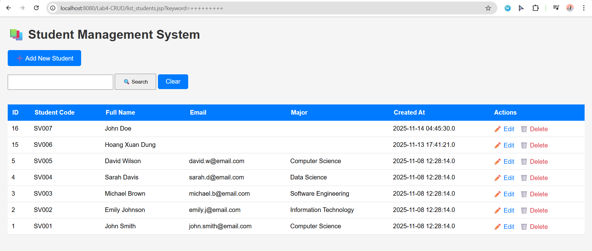
---

## 1️⃣ Purpose and Scope

**Goal:**  
Extend the **Student List** page (`list_students.jsp`) with a **search feature (EX5)** so that the user can:

- Type a **keyword** in a search box.
- Click **Search** to filter students by:
  - `student_code`
  - `full_name`
  - `email`
  - `major`
- Click **Clear** to remove the filter and show the **full list** again.

**Assessed Skills:**

- Designing a search form with `method="GET"`
- Reading request parameters with `request.getParameter(...)`
- Building dynamic SQL based on the presence of a search keyword
- Executing a query and rendering filtered results in HTML
- Understanding **what code runs** when the user:
  - opens the page
  - types a keyword and clicks **Search**
  - clicks **Clear**
  - leaves the keyword empty

---

## 2️⃣ File Location and How the Server Finds It

### 📁 Physical Location

```text
src/main/webapp/list_students.jsp
```

### 🌐 Runtime URL (Tomcat)

```text
http://localhost:8080/Lab4-CRUD/list_students.jsp
```

Tomcat automatically maps any JSP file under `src/main/webapp` to a URL with the same path.  
When the user opens the Student List or submits the search form, the browser always sends a request to:

```text
GET /Lab4-CRUD/list_students.jsp
```

Optionally with a query string, e.g.:

```text
GET /Lab4-CRUD/list_students.jsp?keyword=John
```

---

## 3️⃣ JSP Directives and Imports

At the top of the file:

```jsp
<%@ page language="java" contentType="text/html; charset=UTF-8" pageEncoding="UTF-8"%>
<%@ page import="java.sql.*" %>
```

Explanation:

| Part | Meaning |
|------|---------|
| `language="java"` | JSP uses Java as the scripting language. |
| `contentType="text/html; charset=UTF-8"` | Response is HTML, encoded as UTF-8. |
| `pageEncoding="UTF-8"` | JSP source file is read as UTF-8 (important for Vietnamese). |
| `import="java.sql.*"` | Allows direct use of `Connection`, `Statement`, `ResultSet`, etc. |

These directives are evaluated **before** any HTML is sent, so the page knows which classes and encodings to use during rendering.

---

## 4️⃣ New UI Elements for EX5 – Search Form

Right below the page title and messages, we added:

```jsp
<a href="add_student.jsp" class="btn">➕ Add New Student</a>

<!-- 🔥 EX5 ADDED – SEARCH FORM -->
<form class="search-box" action="list_students.jsp" method="get" style="margin-bottom: 20px;">
    <input 
        type="text" 
        name="keyword" 
        placeholder="Search by code, name, email, major..." 
        value="<%= request.getParameter("keyword") != null ? request.getParameter("keyword") : "" %>"
    />
    <button type="submit">🔍 Search</button>
    <a href="list_students.jsp" class="btn">Clear</a>
</form>
<!-- 🔥 END EX5 -->
```

### How it works

- The `<form>` has:
  - `action="list_students.jsp"` → when the user clicks **Search**, the browser sends a **GET** request to the same JSP.
  - `method="get"` → the keyword is sent in the **query string** as `?keyword=...`.

- The `<input>`:
  - Has `name="keyword"` → the parameter will be read on the server using `request.getParameter("keyword")`.
  - Uses `value="<%= ... %>"`:
    - If there is already a `keyword` parameter in the request, the input will be pre-filled with it.
    - This gives the user feedback about **what they just searched for**.

- The **Search button** (`<button type="submit">`):
  - Triggers the form submission, sending the keyword to the server.

- The **Clear link** (`<a href="list_students.jsp" class="btn">Clear</a>`):
  - Navigates back to `list_students.jsp` **without** query parameters.
  - This causes the page to reload with **no keyword**, so the full list is shown.

---

## 5️⃣ Database Connection Setup (Unchanged from EX1)

Inside the `<tbody>` we have the DB access code:

```jsp
<%
    Connection conn = null;
    Statement stmt = null;
    ResultSet rs = null;

    try {
        Class.forName("com.mysql.cj.jdbc.Driver");

        conn = DriverManager.getConnection(
            "jdbc:mysql://localhost:3306/student_management",
            "root",
            "Taolavodoi@123"
        );

        stmt = conn.createStatement();
        ...
%>
```

**Flow:**
1. Declare `Connection`, `Statement`, `ResultSet` variables.
2. Load the MySQL JDBC driver.
3. Create a DB connection to the `student_management` database.
4. Use the connection to create a `Statement` object.
5. Later, use `stmt.executeQuery(sql)` to retrieve student rows.

These steps are the same for both normal listing and searching – only the **SQL string** changes based on the keyword.

---

## 6️⃣ EX5 Core Logic – Dynamic SQL Based on `keyword`

This is the heart of EX5:

```jsp
        // 🔥 EX5 SEARCH SQL
        String keyword = request.getParameter("keyword");
        String sql;

        if (keyword != null && !keyword.trim().isEmpty()) {
            keyword = keyword.trim();
            sql = "SELECT * FROM students WHERE "
                + "student_code LIKE '%" + keyword + "%' OR "
                + "full_name LIKE '%" + keyword + "%' OR "
                + "email LIKE '%" + keyword + "%' OR "
                + "major LIKE '%" + keyword + "%' "
                + "ORDER BY id DESC";
        } else {
            sql = "SELECT * FROM students ORDER BY id DESC";
        }

        rs = stmt.executeQuery(sql);
```

### Step-by-step explanation

1. **Read request parameter**

   ```java
   String keyword = request.getParameter("keyword");
   ```

   - If the user visited `/list_students.jsp` directly:
     - No `keyword` parameter → `keyword == null`.
   - If the user submitted the search form:
     - URL looks like `/list_students.jsp?keyword=John` → `keyword == "John"`.

2. **Decide which SQL to use**

   ```java
   String sql;

   if (keyword != null && !keyword.trim().isEmpty()) {
       keyword = keyword.trim();
       // build search query
   } else {
       // default query
   }
   ```

   - If `keyword` is **null** or **empty after trimming**, we run the **default query**.
   - If `keyword` is **non-empty**, we run a **search query with WHERE + LIKE**.

3. **Search case – keyword is not empty**

   ```java
   sql = "SELECT * FROM students WHERE "
       + "student_code LIKE '%" + keyword + "%' OR "
       + "full_name LIKE '%" + keyword + "%' OR "
       + "email LIKE '%" + keyword + "%' OR "
       + "major LIKE '%" + keyword + "%' "
       + "ORDER BY id DESC";
   ```

   - The query looks for the keyword in **four columns**:
     - `student_code`
     - `full_name`
     - `email`
     - `major`
   - The `%keyword%` pattern means:
     - Any string **containing** the keyword, not just equal to it.

   **Examples:**
   - `keyword="John"` → matches `"John Smith"`, `"Johnny"`, etc.
   - `keyword="SV001"` → matches row where `student_code = 'SV001'`.
   - `keyword="science"` → matches `"Computer Science"`, `"Data Science"` majors.

4. **Default case – no keyword**

   ```java
   sql = "SELECT * FROM students ORDER BY id DESC";
   ```

   - This is exactly the same behavior as EX1: show all students ordered by **most recently added**.

5. **Execute query**

   ```java
   rs = stmt.executeQuery(sql);
   ```

   - The query result is then looped over and printed into `<tr>...</tr>` rows (same as EX1).

---

## 7️⃣ Rendering the Search Results in the Table

The rest of the code loops through `ResultSet` and prints one table row per student:

```jsp
        while (rs.next()) {
            int id = rs.getInt("id");
            String studentCode = rs.getString("student_code");
            String fullName = rs.getString("full_name");
            String email = rs.getString("email");
            String major = rs.getString("major");
            Timestamp createdAt = rs.getTimestamp("created_at");
%>
            <tr>
                <td><%= id %></td>
                <td><%= studentCode %></td>
                <td><%= fullName %></td>
                <td><%= email != null ? email : "N/A" %></td>
                <td><%= major != null ? major : "N/A" %></td>
                <td><%= createdAt %></td>
                <td>
                    <a href="edit_student.jsp?id=<%= id %>" class="action-link">✏️ Edit</a>
                    <a href="delete_student.jsp?id=<%= id %>"
                       class="action-link delete-link"
                       onclick="return confirm('Are you sure?')">🗑️ Delete</a>
                </td>
            </tr>
<%
        }
```

### Key points

- This block does **not** know whether the page is in “search mode” or “normal mode”.  
- It simply prints whatever rows come out of `rs`:
  - When no keyword: all students.
  - When searching: only matching students.

So the **only difference** between search vs. no search is the **SQL query** built earlier.

---

## 8️⃣ What Happens in Each User Scenario?

### Scenario A – User opens the page for the first time

1. Browser sends:
   ```text
   GET /Lab4-CRUD/list_students.jsp
   ```
2. `keyword = request.getParameter("keyword")` → `null`.
3. `if (keyword != null && !keyword.trim().isEmpty())` → **false**.
4. SQL becomes:  
   ```sql
   SELECT * FROM students ORDER BY id DESC;
   ```
5. All students are shown in the table.
6. Search input is **empty** because `request.getParameter("keyword")` is `null`.

---

### Scenario B – User types `"John"` and clicks **Search**

1. Browser sends:
   ```text
   GET /Lab4-CRUD/list_students.jsp?keyword=John
   ```
2. `keyword = "John"` → not null and not empty.
3. Search SQL is built:

   ```sql
   SELECT * FROM students
   WHERE student_code LIKE '%John%'
      OR full_name   LIKE '%John%'
      OR email       LIKE '%John%'
      OR major       LIKE '%John%'
   ORDER BY id DESC;
   ```

4. Only matching rows (where any of the 4 fields contain “John”) are returned.
5. The **search box is pre-filled** with `"John"` because of:

   ```jsp
   value="<%= request.getParameter("keyword") != null ? request.getParameter("keyword") : "" %>"
   ```

---

### Scenario C – User leaves the keyword empty and clicks **Search**

1. Browser sends:
   ```text
   GET /Lab4-CRUD/list_students.jsp?keyword=
   ```
2. On the server: `keyword = ""` (empty string).
3. Condition:

   ```java
   if (keyword != null && !keyword.trim().isEmpty())
   ```

   - `keyword != null` → `true`.
   - `!keyword.trim().isEmpty()` → `! "".isEmpty()` → `! true` → `false`.

   So the whole `if` is **false**.

4. Page falls back to default SQL:

   ```sql
   SELECT * FROM students ORDER BY id DESC;
   ```

5. This means an empty search behaves like “show all students”.

---

### Scenario D – User clicks **Clear**

1. The Clear button is just a link:

   ```html
   <a href="list_students.jsp" class="btn">Clear</a>
   ```

2. Browser sends a plain request:

   ```text
   GET /Lab4-CRUD/list_students.jsp
   ```

3. There is **no `keyword`** in the query string → `keyword == null`.
4. The default SQL (`SELECT * FROM students ORDER BY id DESC`) is used.
5. The search input becomes **empty** again.

---

## 9️⃣ Error Handling and Resource Cleanup

At the end of the DB block:

```jsp
    } catch (ClassNotFoundException e) {
        out.println("<tr><td colspan='7'>Error: JDBC Driver not found!</td></tr>");
    } catch (SQLException e) {
        out.println("<tr><td colspan='7'>Database Error: " + e.getMessage() + "</td></tr>");
    } finally {
        try { if (rs != null) rs.close(); } catch (SQLException e) {}
        try { if (stmt != null) stmt.close(); } catch (SQLException e) {}
        try { if (conn != null) conn.close(); } catch (SQLException e) {}
    }
%>
```

- If the driver is not found → show a single row with an error message.
- If there is a SQL error → show a single row with the DB error message.
- In `finally`, `ResultSet`, `Statement`, and `Connection` are closed if they were opened.

This ensures that **search mode** does not leak resources or change the error handling logic.

---

## 🔟 Test Cases (How the Teacher Will Check EX5)

You should manually test the following cases in the browser:

1. **Normal list**
   - Open `/list_students.jsp` with no keyword.
   - ✅ Expect: All students displayed, search box empty.

2. **Search by name**
   - Type `John` in the search box → click **Search**.
   - ✅ Expect: Only rows whose `full_name` contains “John” appear.

3. **Search by student code**
   - Type `SV001` → click **Search**.
   - ✅ Expect: Row with `student_code = 'SV001'` appears.

4. **Search by major keyword**
   - Type `science` → click **Search**.
   - ✅ Expect: Students with majors like “Computer Science”, “Data Science” appear.

5. **Empty keyword**
   - Leave search box empty → click **Search**.
   - ✅ Expect: Same as normal list (show all students).

6. **No matching results**
   - Type something like `zzzzzzz` → click **Search**.
   - ✅ Expect: Empty table body (or message “No results” if you add that).

7. **Clear button**
   - After any search, click **Clear**.
   - ✅ Expect: Full list again, search box cleared.

---

## 1️⃣1️⃣ Notes and Possible Improvements

- **Security:**  
  Currently, the search query is built with string concatenation, which is vulnerable to SQL injection **in real applications**.  
  A safer version would use `PreparedStatement` with `?` and `setString()`.  
  However, for this lab, the focus is on understanding request parameters and dynamic SQL, not security hardening.

- **Highlighting Search Term (Bonus):**  
  You could highlight the keyword inside the result cells (e.g., wrap it in `<mark>...</mark>`).  
  This would make EX5 visually clearer for the user and may earn extra points.

- **Refactoring:**  
  In a bigger project, database access logic should be moved into a DAO class instead of writing directly in JSP.

---

## ✅ Summary

EX5 adds a **search feature** on top of the existing student list:

- **UI:** a search box and a Clear button on `list_students.jsp`.
- **Server-side logic:** read `keyword`, build either a **search SQL** (with multiple `LIKE` conditions) or the **default SQL**.
- **Behavior:** user interactions (open page, search, clear, empty keyword) directly influence which SQL query runs and therefore which rows appear in the HTML table.

# 🧾 EX6 – Report: Validation Enhancement (`process_add.jsp` + `process_edit.jsp`)

## DEMO

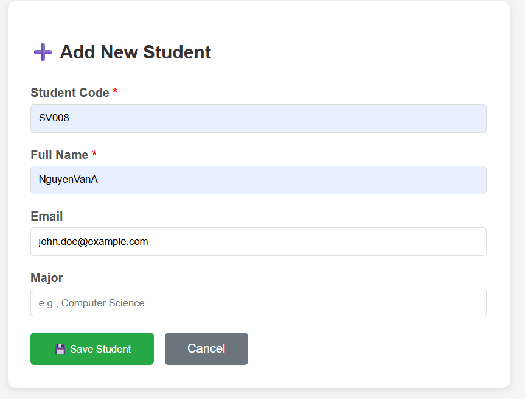
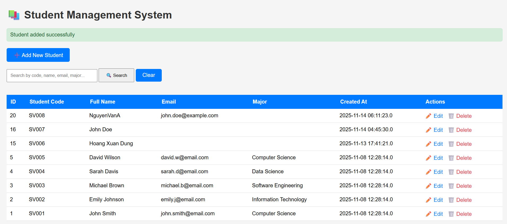
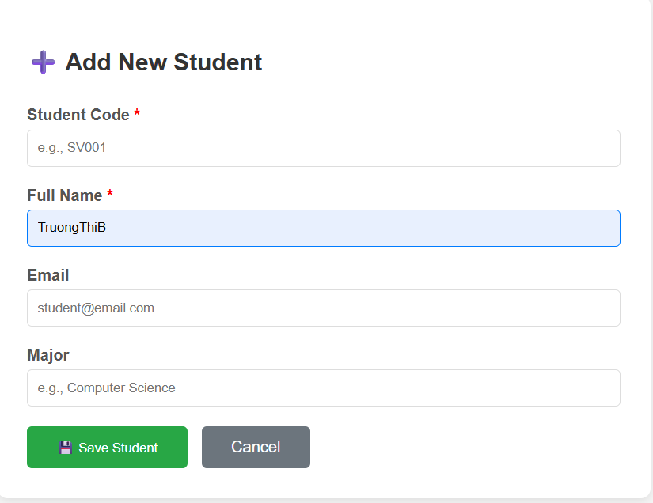
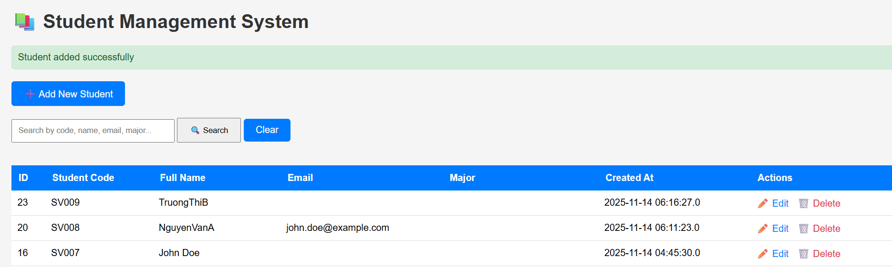


---

## 1️⃣ Purpose and Scope

**Goal of EX6:**  
Strengthen **input validation** and **error handling** for:

- **Create** operation: `process_add.jsp`
- **Update** operation: `process_edit.jsp`

so that:

- Required fields cannot be empty.
- `student_code` follows a strict format.
- `email` (if provided) has a valid format.
- Invalid or missing IDs are handled gracefully.
- Errors are shown to the user with **clear messages**.
- The user is redirected to the **correct page** depending on the situation.

**Big idea:**  
> Don’t trust the browser. Even if HTML uses `required`, `pattern`, or `type="email"`, the server must **re-check everything** before writing to the database.

EX6 builds on EX2 and EX3:
- EX2: basic validation for **Add**.
- EX3: basic validation for **Edit**.
- **EX6**: more advanced, stricter validation and clearer error flows.

---

## 2️⃣ Files Involved in EX6

Validation enhancement touches **two main “process” pages**:

1. **Add student** (Create)
   - HTML form: `add_student.jsp` (already described in EX2)
   - Processing logic: **`process_add.jsp`** ✅ (EX6 focus)

2. **Edit student** (Update)
   - HTML form: `edit_student.jsp` (already described in EX3)
   - Processing logic: **`process_edit.jsp`** ✅ (EX6 focus)

Physical locations (typical Maven layout):

```text
src/main/webapp/add_student.jsp
src/main/webapp/process_add.jsp

src/main/webapp/edit_student.jsp
src/main/webapp/process_edit.jsp
```

Runtime URLs (Tomcat):

```text
http://localhost:8080/Lab4-CRUD/add_student.jsp
http://localhost:8080/Lab4-CRUD/process_add.jsp

http://localhost:8080/Lab4-CRUD/edit_student.jsp?id=...
http://localhost:8080/Lab4-CRUD/process_edit.jsp
```

---

## 3️⃣ `process_add.jsp` – Enhanced Validation for Create

### 3.1. JSP Header and Imports

At the top of `process_add.jsp`:

```jsp
<%@ page language="java" contentType="text/html; charset=UTF-8" pageEncoding="UTF-8"%>
<%@ page import="java.sql.*" %>
<%
    request.setCharacterEncoding("UTF-8");
%>
```

**Purpose:**
- Use Java as script language.
- Return HTML in UTF-8 encoding.
- Allow usage of JDBC classes (`Connection`, `PreparedStatement`, `ResultSet`, …).
- Ensure request parameters are read as UTF-8 (important for Vietnamese names).

---

### 3.2. Reading and Validating Input Fields

Core part at the beginning:

```jsp
String studentCode = request.getParameter("student_code");
String fullName    = request.getParameter("full_name");
String email       = request.getParameter("email");
String major       = request.getParameter("major");
```

#### Step 1 – Required fields (`student_code` and `full_name`)

```jsp
if (studentCode == null || studentCode.trim().isEmpty() ||
    fullName    == null || fullName.trim().isEmpty()) {

    response.sendRedirect("add_student.jsp?error=Required fields are missing");
    return;
}
```

- If **either** `studentCode` or `fullName` is missing or only spaces:
  - Immediately **redirect** back to `add_student.jsp`.
  - Attach an error message: `?error=Required fields are missing`.
  - `return;` stops further processing (no DB action).

This guarantees the DB is never touched with missing required data.

#### Step 2 – Student code pattern validation

```jsp
if (!studentCode.matches("[A-Z]{2}[0-9]{3,}")) {
    response.sendRedirect("add_student.jsp?error=Invalid student code format");
    return;
}
```

- Regex: `[A-Z]{2}[0-9]{3,}` means:
  - Exactly **2 uppercase letters** (`[A-Z]{2}`), e.g. `SV`, `IT`, `CS`.
  - Followed by **3 or more digits** (`[0-9]{3,}`), e.g. `001`, `123`, `4567`.

Valid examples:
- `SV001`, `IT123`, `CS4567`

Invalid examples:
- `sv001` (lowercase)
- `S01` (only 1 letter + 2 digits)
- `ABC12` (3 letters)
- `SV12A` (non-digit at the end)

> 👉 If the format is wrong, no DB access happens; the user is sent back to the form with a clear message.

#### Step 3 – Email validation (optional field)

```jsp
if (email != null && !email.trim().isEmpty()) {
    if (!email.matches("^[A-Za-z0-9+_.-]+@(.+)$")) {
        response.sendRedirect("add_student.jsp?error=Invalid email format");
        return;
    }
}
```

- Email is **optional**, but if the user fills it, format must be valid.
- Regex is a simple email validation (not perfect, but sufficient for the lab).

If invalid:
- Redirect back to `add_student.jsp` with `error=Invalid email format`.

#### Step 4 – Trimming values (recommended)

Before saving to DB, it is good practice to `trim()`:

```jsp
studentCode = studentCode.trim();
fullName    = fullName.trim();
if (email != null) email = email.trim();
if (major != null) major = major.trim();
```

This prevents accidental leading/trailing spaces in the database.

---

### 3.3. Database Insert with PreparedStatement

After validation passes, we talk to the DB:

```jsp
Connection conn = null;
PreparedStatement pstmt = null;

try {
    Class.forName("com.mysql.cj.jdbc.Driver");
    conn = DriverManager.getConnection(
        "jdbc:mysql://localhost:3306/student_management",
        "root",
        "YOUR_PASSWORD"
    );

    String sql = "INSERT INTO students (student_code, full_name, email, major) VALUES (?, ?, ?, ?)";
    pstmt = conn.prepareStatement(sql);

    pstmt.setString(1, studentCode);
    pstmt.setString(2, fullName);
    pstmt.setString(3, email);
    pstmt.setString(4, major);

    int rowsAffected = pstmt.executeUpdate();
```

Key points:

- `PreparedStatement` is used instead of string concatenation.
  - Prevents SQL injection.
  - Easier to maintain.
- If validations have passed, we know the data is safe and clean enough.

### 3.4. Handling Insert Result and Errors

Result handling:

```jsp
    if (rowsAffected > 0) {
        response.sendRedirect("list_students.jsp?message=Student added successfully");
    } else {
        response.sendRedirect("add_student.jsp?error=Failed to add student");
    }
} catch (SQLException e) {
    String errorMsg = e.getMessage();
    if (errorMsg != null && errorMsg.contains("Duplicate entry")) {
        response.sendRedirect("add_student.jsp?error=Student code already exists");
    } else {
        response.sendRedirect("add_student.jsp?error=Database error");
    }
} catch (Exception e) {
    response.sendRedirect("add_student.jsp?error=Unexpected error occurred");
} finally {
    try { if (pstmt != null) pstmt.close(); } catch (SQLException e) {}
    try { if (conn  != null) conn.close();  } catch (SQLException e) {}
}
```

**Scenarios:**
- Insert success → redirect to list page with a **success message**.
- Insert fails with a **duplicate student_code** (UNIQUE constraint):
  - Error message: `Student code already exists`.
- Other SQL error → generic `Database error`.
- Any other exception → `Unexpected error occurred`.

> 🔑 EX6 requirement here: properly distinguish **validation errors** vs **database errors** and show meaningful messages.

---

### 3.5. Behavior Summary for `process_add.jsp`

| User Action / Input                            | What Code Runs | Outcome |
|-----------------------------------------------|----------------|---------|
| Missing `student_code` or `full_name`         | Required-field `if` → redirect add with error | No DB access; error shown on form |
| Invalid `student_code` pattern                 | Regex `matches("[A-Z]{2}[0-9]{3,}")` fails → redirect | No DB access; error shown |
| Invalid email format (non-empty but wrong)    | Email regex fails → redirect | No DB access; error shown |
| Valid data, unique student_code               | All validations pass → `INSERT` is executed | New student added; redirect to list with success |
| Valid data but duplicate `student_code`       | `SQLException` contains `"Duplicate entry"` | Redirect add with `Student code already exists` |
| Unknown error during DB connection / insert   | Generic catch → redirect with `Database error` or `Unexpected error` | User sees error banner |

---

## 4️⃣ `process_edit.jsp` – Enhanced Validation for Update

### 4.1. JSP Header and Parameter Reading

At the top of `process_edit.jsp`:

```jsp
<%@ page language="java" contentType="text/html; charset=UTF-8" pageEncoding="UTF-8"%>
<%@ page import="java.sql.*" %>

<%
    request.setCharacterEncoding("UTF-8");

    String idParam     = request.getParameter("id");
    String studentCode = request.getParameter("student_code");
    String fullName    = request.getParameter("full_name");
    String email       = request.getParameter("email");
    String major       = request.getParameter("major");
%>
```

### 4.2. Basic Validation: ID Presence and Required Fields

```jsp
if (idParam == null || idParam.trim().isEmpty() ||
    fullName == null || fullName.trim().isEmpty()) {

    response.sendRedirect("list_students.jsp?error=Invalid data");
    return;
}
```

- `idParam` must be present and not empty.
- `fullName` cannot be empty (required field for update).

Next, we **parse** the ID safely:

```jsp
int studentId = 0;
try {
    studentId = Integer.parseInt(idParam);
} catch (NumberFormatException e) {
    response.sendRedirect("list_students.jsp?error=Invalid ID format");
    return;
}
```

- If `id` is not a number (e.g., `abc`), we avoid `NumberFormatException` and show a **clean error** instead of HTTP 500.

> 🔑 This fulfills the rubric requirement: “Properly handles invalid IDs”.

### 4.3. Student Code and Email Validation

Even if `student_code` is readonly in the form, EX6 still validates it:

```jsp
if (studentCode == null || !studentCode.matches("[A-Z]{2}[0-9]{3,}")) {
    response.sendRedirect("edit_student.jsp?id=" + idParam + "&error=Invalid student code format");
    return;
}
```

- Ensures the code coming from the form has the expected format.
- If someone manipulates the form in DevTools, validation still catches it.

Email validation is similar to `process_add.jsp`:

```jsp
if (email != null && !email.trim().isEmpty()) {
    if (!email.matches("^[A-Za-z0-9+_.-]+@(.+)$")) {
        response.sendRedirect("edit_student.jsp?id=" + idParam + "&error=Invalid email format");
        return;
    }
}
```

### 4.4. Trimming Values

Again, trimming before update is recommended:

```jsp
fullName = fullName.trim();
if (email != null) email = email.trim();
if (major != null) major = major.trim();
```

### 4.5. Database Update with PreparedStatement

```jsp
Connection conn = null;
PreparedStatement pstmt = null;

try {
    Class.forName("com.mysql.cj.jdbc.Driver");
    conn = DriverManager.getConnection(
        "jdbc:mysql://localhost:3306/student_management",
        "root",
        "YOUR_PASSWORD"
    );

    String sql = "UPDATE students SET full_name = ?, email = ?, major = ? WHERE id = ?";
    pstmt = conn.prepareStatement(sql);

    pstmt.setString(1, fullName);
    pstmt.setString(2, email);
    pstmt.setString(3, major);
    pstmt.setInt(4, studentId);

    int rowsAffected = pstmt.executeUpdate();
```

### 4.6. Handling Update Result and Errors

```jsp
    if (rowsAffected > 0) {
        response.sendRedirect("list_students.jsp?message=Student updated successfully");
    } else {
        response.sendRedirect("edit_student.jsp?id=" + studentId + "&error=Update failed");
    }
} catch (SQLException e) {
    response.sendRedirect("edit_student.jsp?id=" + studentId + "&error=Database error");
} catch (Exception e) {
    response.sendRedirect("edit_student.jsp?id=" + studentId + "&error=Unexpected error");
} finally {
    try { if (pstmt != null) pstmt.close(); } catch (SQLException e) {}
    try { if (conn  != null) conn.close();  } catch (SQLException e) {}
}
```

Scenarios:

- `rowsAffected > 0` → update succeeded → redirect to list with success message.
- `rowsAffected == 0` → possibly ID not found → stay on edit page with `Update failed`.
- SQL error → stay on edit page with `Database error`.
- Other exceptions → stay on edit page with `Unexpected error`.

> Notice that all error redirects **include the `id` parameter** so that `edit_student.jsp` can reload the correct record and display the error banner.

---

### 4.7. Behavior Summary for `process_edit.jsp`

| User Action / Input                                      | What Code Runs | Outcome |
|---------------------------------------------------------|----------------|---------|
| Missing or empty `id` / `full_name`                     | Early `if` → redirect list with `Invalid data` | No update |
| Non-numeric `id` (e.g., `abc`)                          | `Integer.parseInt` in try/catch → redirect list with `Invalid ID format` | No update |
| Invalid `student_code` format (tampered or bad data)    | Regex fails → redirect back to `edit_student.jsp?id=...&error=Invalid student code format` | No update |
| Invalid email format                                    | Email regex fails → redirect back to edit page with error | No update |
| Valid data, ID exists                                   | UPDATE executes, `rowsAffected > 0` → redirect to list with success | Row updated |
| Valid data, ID not found                                | `rowsAffected == 0` → redirect `edit_student.jsp?id=...&error=Update failed` | User sees error |
| SQL / other exceptions                                  | Catch blocks → redirect back to edit with generic error | No update |

---

## 5️⃣ Combined Flow: From Form to Validation to DB

### 5.1. Add Flow (Create)

```text
add_student.jsp (user fills form)
   ↓  [Save]
POST /process_add.jsp
   ↓  Required fields check
   ↓  Student code pattern check
   ↓  Email format check (if not empty)
   ↓  If any validation fails → redirect back to add_student.jsp?error=...
   ↓  If all validations pass → INSERT student
   ↓  If INSERT ok → redirect list_students.jsp?message=Student added successfully
   ↓  If duplicate / DB error → redirect add_student.jsp?error=...
```

### 5.2. Edit Flow (Update)

```text
edit_student.jsp?id=5 (prefilled form)
   ↓  [Update]
POST /process_edit.jsp
   ↓  Check id + full_name not null/empty
   ↓  Try parse id → if invalid → list_students.jsp?error=Invalid ID format
   ↓  Validate student_code pattern
   ↓  Validate email format (if not empty)
   ↓  If any validation fails → redirect back to edit_student.jsp?id=5&error=...
   ↓  If all validations pass → UPDATE students SET ...
   ↓  If rowsAffected > 0 → list_students.jsp?message=Student updated successfully
   ↓  If rowsAffected == 0 → edit_student.jsp?id=5&error=Update failed
   ↓  If SQL / other error → edit_student.jsp?id=5&error=Database/Unexpected error
```

---

## 6️⃣ Test Cases for EX6

You should manually verify at least these cases:

### Add (`process_add.jsp`)

1. **Empty required fields**
   - Leave `Student Code` and/or `Full Name` empty.
   - ✅ Expect: Redirect back to `add_student.jsp` with `Required fields are missing`.

2. **Invalid student code format**
   - Try: `sv001`, `S01`, `ABC12`, `SV12A`.
   - ✅ Expect: Error `Invalid student code format`.

3. **Invalid email format**
   - Enter `abc`, `test@`, `@gmail.com`.
   - ✅ Expect: Error `Invalid email format`.

4. **Duplicate student code**
   - Add a student with an existing `student_code`.
   - ✅ Expect: Error `Student code already exists`.

5. **Valid data**
   - Proper code, full name, optional valid email, major.
   - ✅ Expect: Redirect to list with `Student added successfully` and new row appears.

### Edit (`process_edit.jsp`)

6. **Invalid ID in request**
   - Manually change URL to `process_edit.jsp?id=abc` or `id=`.
   - ✅ Expect: Redirect to list with `Invalid ID format` or `Invalid data` (depending on implementation).

7. **Empty full name**
   - Clear full name → click Update.
   - ✅ Expect: Error and no update.

8. **Invalid email format on edit**
   - Enter malformed email.
   - ✅ Expect: `Invalid email format` on edit page.

9. **Valid update**
   - Modify full name, optional email/major correctly.
   - ✅ Expect: `Student updated successfully` on list page, row updated.

10. **ID not found (edge case)**
    - If possible, try editing a record that was deleted between loading and saving.
    - ✅ Expect: `Update failed` (rowsAffected == 0).

---

## 7️⃣ Why EX6 Matters

- In real-world applications, bad validation leads to:
  - Corrupted data (wrong formats in DB).
  - Security issues (SQL injection, unexpected input).
  - Poor user experience (no helpful error messages).

- EX6 forces you to think in terms of **all possible paths**:
  - Normal path (happy path).
  - Error path (validation failures).
  - Edge cases (invalid ID, duplicate code, DB failure).

By the end of EX6, you should be able to trace exactly:

> “If the user types X and clicks **Save**, which `if` conditions run, which redirects happen, and which SQL statements will (or will not) execute?”

That is the core learning objective behind this exercise.

---

## ✅ Summary

- `process_add.jsp` and `process_edit.jsp` now contain **stronger server-side validations**.
- Required fields are enforced, formats are checked with regex, and invalid IDs are handled.
- All error paths lead to **clear error messages** displayed on the correct JSP forms.
- Successful operations redirect to `list_students.jsp` with a success message.

---

# Exercise 7: User Experience (EX7)

---

## DEMO


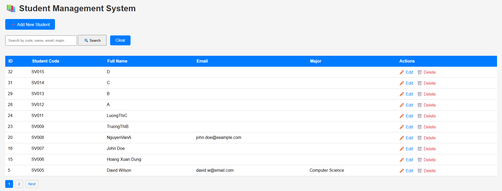

---

## 1. Objective

The goal of EX7 is to improve the **user experience (UX)** of the Student Management System that was built in Exercises 1–6.

Concretely, EX7 focuses on:

1. **Pagination**  
   - Show the student list in multiple pages instead of one long list.  
   - Display **10 students per page** (as required in the lab).  
   - Provide navigation links: *Previous*, *Next*, and page numbers (1, 2, 3, …).

2. **User feedback via flash messages**  
   - After operations like **Add**, **Edit**, or **Delete**, show a clear message at the top of the list page.  
   - Distinguish between **success** messages (green) and **error** messages (red).  
   - Messages should automatically disappear after a short period (3 seconds) so the UI stays clean.

These UX improvements do not change the core CRUD logic, but they make the application much more user‑friendly and easier to demo.

---

## 2. Files Involved in EX7

EX7 mainly touches the following JSP files:

1. **`list_students.jsp`**
   - Displays the main student list.
   - Implements **pagination** (10 records per page).
   - Displays **success / error flash messages** at the top of the page.
   - Contains **JavaScript** to auto‑hide the messages.

2. **`process_add.jsp`**
   - Handles the **Add Student** form submission.
   - After inserting a new student, it redirects back to `list_students.jsp` with a success or error message in the URL query string.

3. **`process_edit.jsp`**
   - Handles the **Edit Student** form submission.
   - After updating an existing student, it redirects back to `list_students.jsp` with a success or error message.

4. **`delete_student.jsp`**
   - Handles deleting a student based on the `id` parameter in the URL.
   - After deletion (or failure), it redirects back to `list_students.jsp` with a success or error message.

> Notes:  
> - `add_student.jsp` and `edit_student.jsp` are still used to display the forms, but the EX7 UX behavior is mainly visible on `list_students.jsp` (pagination + messages).  
> - The database schema and sample data are the same as previous exercises (table `students` in database `student_management`).

---

## 3. Feature 1 – Pagination (10 Students per Page)

### 3.1 Concept

Without pagination, `list_students.jsp` would show *all* rows from the `students` table, which becomes uncomfortable to read and slow when there are many records.

With EX7, the list is split into **pages**, and each page shows at most **10 students**:

- Page 1: students 1–10  
- Page 2: students 11–20  
- Page 3: students 21–30  
- … and so on

The current page is controlled by a request parameter:

```text
list_students.jsp?page=1
list_students.jsp?page=2
...
```

### 3.2 Server-side Logic in `list_students.jsp`

1. **Determine current page**

```java
int recordsPerPage = 10;   // Requirement: 10 students per page
int currentPage = 1;

String pageParam = request.getParameter("page");
if (pageParam != null && !pageParam.trim().isEmpty()) {
    try {
        currentPage = Integer.parseInt(pageParam);
        if (currentPage < 1) currentPage = 1;
    } catch (NumberFormatException e) {
        currentPage = 1; // fallback if page parameter is invalid
    }
}
```

2. **Calculate offset**

```java
int offset = (currentPage - 1) * recordsPerPage;
```

This offset is used in the SQL query to skip the previous records.

3. **Count total records**

```java
int totalRecords = 0;
int totalPages = 1;

// If search keyword is supported, the COUNT(*) query may include WHERE conditions
String countSql = "SELECT COUNT(*) FROM students";
// (optional) append WHERE for keyword search

PreparedStatement countStmt = conn.prepareStatement(countSql);
// (optional) set parameters for keyword

ResultSet countRs = countStmt.executeQuery();
if (countRs.next()) {
    totalRecords = countRs.getInt(1);
}
countRs.close();
countStmt.close();

if (totalRecords > 0) {
    totalPages = (int) Math.ceil((double) totalRecords / recordsPerPage);
} else {
    totalPages = 1;
}
```

4. **Query students for the current page**

```java
String sql = "SELECT * FROM students";
// (optional) add WHERE for search keyword
sql += " ORDER BY id DESC LIMIT ? OFFSET ?";

PreparedStatement pstmt = conn.prepareStatement(sql);
// (optional) set keyword parameters first
pstmt.setInt(paramIndex++, recordsPerPage);
pstmt.setInt(paramIndex, offset);

ResultSet rs = pstmt.executeQuery();
```

5. **Display pagination links**

At the bottom of the table, the code generates links like:

```jsp
<div class="pagination">
    <% if (currentPage > 1) { %>
        <a href="list_students.jsp?page=<%= currentPage - 1 %>">Previous</a>
    <% } %>

    <% for (int i = 1; i <= totalPages; i++) {
         if (i == currentPage) { %>
             <a href="list_students.jsp?page=<%= i %>" class="active"><%= i %></a>
    <%   } else { %>
             <a href="list_students.jsp?page=<%= i %>"><%= i %></a>
    <%   }
       } %>

    <% if (currentPage < totalPages) { %>
        <a href="list_students.jsp?page=<%= currentPage + 1 %>">Next</a>
    <% } %>
</div>
```

### 3.3 Summary of Pagination Workflow

1. Read `page` parameter (default to 1).  
2. Compute `offset = (page - 1) * 10`.  
3. Run `SELECT COUNT(*)` to know how many records exist.  
4. Compute total pages using `Math.ceil`.  
5. Run `SELECT ... LIMIT ? OFFSET ?` to fetch only 10 students.  
6. Render page links so the user can navigate between pages.

---

## 4. Feature 2 – Flash Messages with Auto-hide

### 4.1 Concept

After an action like Add/Update/Delete, users need clear feedback:

- Was the action successful?
- If not, what went wrong?

Instead of leaving the user confused, EX7 shows a **flash message** on `list_students.jsp`.

Two types of messages:

- **Success** message: green box with a ✓ icon.  
- **Error** message: red box with a ✗ icon.

The message appears at the top of the screen right after redirect and then **automatically disappears after ~3 seconds**.

### 4.2 How Messages Are Sent (process_*.jsp)

In the process pages, after database operations, the code uses **HTTP redirect** and appends a query parameter:

#### Example in `process_add.jsp`

```jsp
int rowsAffected = pstmt.executeUpdate();

if (rowsAffected > 0) {
    response.sendRedirect("list_students.jsp?message=Student added successfully");
} else {
    response.sendRedirect("list_students.jsp?error=Failed to add student");
}
```

#### Example in `process_edit.jsp`

```jsp
int rowsAffected = pstmt.executeUpdate();

if (rowsAffected > 0) {
    response.sendRedirect("list_students.jsp?message=Student updated successfully");
} else {
    response.sendRedirect("list_students.jsp?error=Failed to update student");
}
```

#### Example in `delete_student.jsp`

```jsp
int rowsAffected = pstmt.executeUpdate();

if (rowsAffected > 0) {
    response.sendRedirect("list_students.jsp?message=Student deleted successfully");
} else {
    response.sendRedirect("list_students.jsp?error=Failed to delete student");
}
```

So the URL becomes something like:

- `list_students.jsp?message=Student added successfully`  
- `list_students.jsp?error=Failed to update student`

### 4.3 How Messages Are Displayed (list_students.jsp)

At the top of `list_students.jsp`, the message parameters are read:

```jsp
String success = request.getParameter("message");
if (success == null || success.trim().isEmpty()) {
    success = request.getParameter("success"); // optional: support both names
}
String error = request.getParameter("error");
```

Then they are displayed using styled `<div>` elements:

```jsp
<% if (success != null && !success.trim().isEmpty()) { %>
    <div id="messageBox" class="message success">
        ✓ <%= success %>
    </div>
<% } else if (error != null && !error.trim().isEmpty()) { %>
    <div id="messageBox" class="message error">
        ✗ <%= error %>
    </div>
<% } %>
```

**CSS styles** (inside `<style>` tag) make them look like notification boxes:

```css
.message {
    padding: 10px 15px;
    border-radius: 4px;
    margin-bottom: 15px;
    font-size: 14px;
    display: inline-block;
    min-width: 260px;
}
.message.success {
    background-color: #d4edda;
    color: #155724;
    border: 1px solid #c3e6cb;
}
.message.error {
    background-color: #f8d7da;
    color: #721c24;
    border: 1px solid #f5c6cb;
}
```

### 4.4 Auto-hide Behavior (JavaScript)

At the bottom of `list_students.jsp`, a simple JavaScript function hides the message after 3 seconds:

```html
<script>
    // Auto-hide message after 3 seconds
    setTimeout(function () {
        var box = document.getElementById('messageBox');
        if (box) {
            box.style.transition = 'opacity 0.5s';
            box.style.opacity = '0';
            setTimeout(function () {
                box.style.display = 'none';
            }, 500);
        }
    }, 3000);
</script>
```

This makes the flash box behave like a small “popup”:  
It appears, informs the user, then fades out automatically without requiring a manual close button.

---

## 5. How to Run & Demo EX7

### 5.1 Environment

- Database: MySQL (`student_management`)
- Table: `students` (same schema as previous exercises)
- Server: Apache Tomcat (via NetBeans / IntelliJ)
- Project: `StudentManagement`

### 5.2 Steps to Demo

1. **Start MySQL** and ensure the `students` table has some sample data (at least more than 10 rows to see pagination).  
2. **Run the web application** on Tomcat.  
3. Open the browser and go to:  
   ```text
   http://localhost:8080/StudentManagement/list_students.jsp
   ```

4. **Demo Pagination:**
   - Show that page 1 only displays up to 10 students.
   - Click page 2 / Next to show more students.
   - Explain how the page number changes in the URL.

5. **Demo Flash Messages:**
   - Add a new student via `add_student.jsp` → show the green success message on `list_students.jsp` and wait for it to disappear.
   - Edit an existing student via `edit_student.jsp` → see “Student updated successfully” message.
   - Delete a student → see “Student deleted successfully” message.
   - If possible, trigger an error (e.g., delete invalid ID) to show the red error box.

6. Optionally, combine **search (EX5)** with pagination and show that both features work together.

---

## 6. Test Cases for EX7

### 6.1 Pagination Test Cases

| Test ID | Scenario                       | Steps                                                                                           | Expected Result                                                                                          |
|---------|--------------------------------|-------------------------------------------------------------------------------------------------|----------------------------------------------------------------------------------------------------------|
| TC7.1.1 | Default page (page 1)         | Open `list_students.jsp` without `page` parameter                                              | Page 1 is shown, table displays at most 10 students, pagination links appear if total records > 10      |
| TC7.1.2 | Go to next page               | From page 1, click page `2` or `Next`                                                          | URL becomes `...page=2`, different students are shown (not the same as page 1), page 2 is highlighted   |
| TC7.1.3 | Go to previous page           | From page 2, click `Previous`                                                                  | URL becomes `...page=1`, students list matches the original page 1                                      |
| TC7.1.4 | Last page behavior            | Navigate to the last page (e.g., highest page number)                                          | Last page displays the remaining students (≤ 10); there is no `Next` link                               |
| TC7.1.5 | Pagination + search (optional)| Search a keyword with more than 10 matches, then navigate to page 2                            | Each page shows up to 10 **filtered** students; URL includes both `keyword` and `page` parameters       |

### 6.2 Flash Message Test Cases

| Test ID | Scenario                      | Steps                                                                                                   | Expected Result                                                                                                    |
|---------|-------------------------------|---------------------------------------------------------------------------------------------------------|--------------------------------------------------------------------------------------------------------------------|
| TC7.2.1 | Show success after Add       | Go to `add_student.jsp`, submit valid student data                                                     | Redirect to `list_students.jsp?message=Student added successfully`; green success message box appears then fades  |
| TC7.2.2 | Show success after Edit      | From list, click `Edit` on any student, change data, submit                                            | Redirect with `message=Student updated successfully`; green box appears and auto‑hides after ~3 seconds           |
| TC7.2.3 | Show success after Delete    | From list, click `Delete` on any student and confirm                                                   | Redirect with `message=Student deleted successfully`; green box appears and then disappears after ~3 seconds      |
| TC7.2.4 | Show error message           | Force an error (e.g., invalid ID, DB issue) to trigger redirect with `error=...`                       | Red error box appears at the top with the error message, then auto‑hides after ~3 seconds                         |

---

## 7. Summary

- EX7 does **not** introduce new CRUD operations, but significantly enhances the **usability** of the app.  
- **Pagination** prevents the list from becoming too long and makes navigation manageable.  
- **Flash messages** provide immediate and clear feedback to the user after each operation.  
- **Auto‑hide behavior** keeps the interface clean while still informing the user about what just happened.

Together with Exercises 1–6, EX7 completes a small but realistic JSP + MySQL CRUD application with much better user experience.

# BONUS EXERCISE – CSV Export (5 points)

---

## DEMO
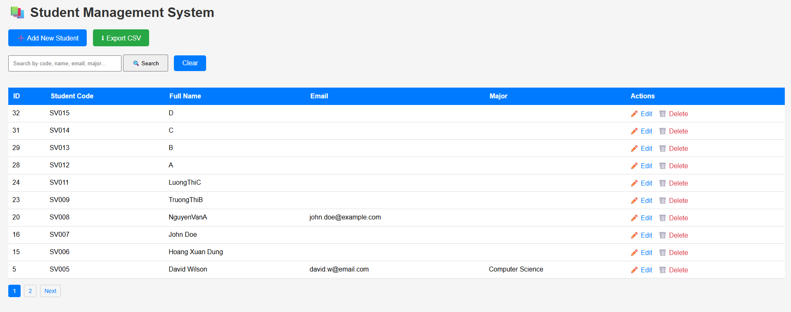
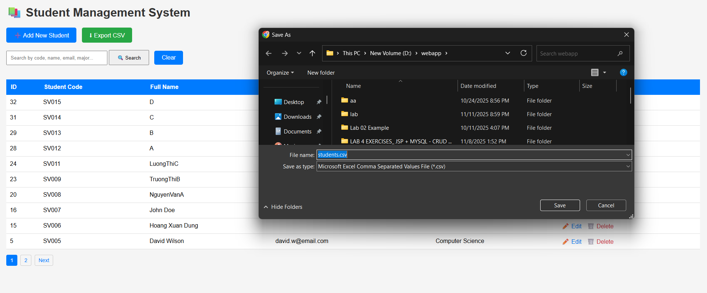

## 1. Objective
This bonus exercise adds a feature that allows the user to **export the entire student list into a CSV file**.  
The CSV file can be opened using Excel, Google Sheets, or any text editor.  
This feature enhances usability by supporting reporting, data sharing, or offline analysis.

---

## 2. Files Modified or Added

### 2.1 `list_students.jsp`
A new UI button **“⬇ Export CSV”** was added next to “Add New Student”.

```html
<a href="export_students_csv.jsp" 
   class="btn" 
   style="margin-left: 10px; background-color:#28a745;">
    ⬇ Export CSV
</a>
```

This button triggers the CSV download.

### 2.2 `export_students_csv.jsp` (NEW)
A new JSP file was created to handle CSV exporting:
- Connects to MySQL
- Retrieves student records
- Formats output as CSV
- Forces browser to download the file

CSV Headers:
```
ID,Student Code,Full Name,Email,Major,Created At
```

---

## 3. Implementation Details

### 3.1 Browser Download Headers
```java
response.setContentType("text/csv; charset=UTF-8");
response.setHeader("Content-Disposition", "attachment; filename=\"students.csv\"");
```

### 3.2 SQL Query
```sql
SELECT id, student_code, full_name, email, major, created_at
FROM students
ORDER BY id ASC;
```

### 3.3 CSV Formatting
Each field is wrapped in quotes (`" "`), and internal quotes are escaped as `""`.

Example:
```csv
"1","SV001","John Doe","john@example.com","IT","2025-01-15 10:00:00"
```

Null values are converted to empty strings.

---

## 4. User Workflow

1. User opens `list_students.jsp`
2. Clicks **⬇ Export CSV**
3. Browser sends request to `export_students_csv.jsp`
4. Server:
   - Queries DB  
   - Generates CSV  
   - Forces download
5. User receives `students.csv` and opens it in Excel or any viewer

---

## 5. Test Cases

### **TC-B1 – Export button appears**
**Step:** Open `list_students.jsp`  
**Expected:** Button “⬇ Export CSV” is visible

### **TC-B2 – Download triggers**
**Step:** Click Export button  
**Expected:** Browser downloads `students.csv`

### **TC-B3 – CSV header is correct**
**Expected header line:**
```
ID,Student Code,Full Name,Email,Major,Created At
```

### **TC-B4 – Record count matches database**
**Expected:** Number of rows (minus header) equals total records in `students` table

### **TC-B5 – Fields correctly formatted**
- Wrapped in quotes  
- Special characters escaped  
- Empty/null fields handled correctly

---

# BONUS EXERCISE – Sorting (5 points)

---

## DEMO


## 1. Objective
This bonus exercise adds a **sorting feature** to the Student Management System.  
Users can sort the student list by different fields such as:

- ID  
- Student Code  
- Full Name  
- Email  
- Major  

Sorting can be done in **ASC (ascending)** or **DESC (descending)** order.

This feature improves data navigation and is useful when the list grows large.

---

## 2. Files Modified

### `list_students.jsp`
This file was updated to include:

1. **New sorting dropdown UI**  
2. Code to read sorting parameters (`sortBy`, `order`)  
3. SQL `ORDER BY` logic using sanitized parameters  
4. Pagination updated to preserve sorting state  

No other files are modified.

---

## 3. Sorting UI (User Interface)

The following dropdowns were added inside the search form:

```html
<span style="margin-left: 20px;">Sort by:</span>
<select name="sortBy">
    <option value="id">ID</option>
    <option value="student_code">Student Code</option>
    <option value="full_name">Full Name</option>
    <option value="email">Email</option>
    <option value="major">Major</option>
</select>

<select name="order">
    <option value="asc">ASC</option>
    <option value="desc">DESC</option>
</select>
```

When the user clicks Search, the browser sends `sortBy` and `order` as GET parameters:
```
list_students.jsp?sortBy=full_name&order=asc
```

---

## 4. Reading Sorting Parameters

The following code reads and validates sorting fields:

```jsp
String sortBy = request.getParameter("sortBy");
if (sortBy == null || sortBy.trim().isEmpty()) sortBy = "id";

String order = request.getParameter("order");
if (order == null || order.trim().isEmpty()) order = "desc";
```

---

## 5. SQL ORDER BY Logic

To avoid SQL injection, sorting values are **whitelisted**:

```jsp
String sortColumn = "id"; 
if ("student_code".equals(sortBy) ||
    "full_name".equals(sortBy) ||
    "email".equals(sortBy) ||
    "major".equals(sortBy)) {
    sortColumn = sortBy;
}

String sortOrder = "DESC";
if ("asc".equalsIgnoreCase(order)) {
    sortOrder = "ASC";
}
```

Final SQL:

```sql
SELECT * FROM students
ORDER BY <sortColumn> <sortOrder>
LIMIT ? OFFSET ?
```

Example generated SQL:

```
ORDER BY full_name ASC
ORDER BY student_code DESC
ORDER BY email ASC
```

---

## 6. Pagination Integration

To ensure sorting stays active when switching pages, pagination URLs now carry sorting parameters:

```
list_students.jsp?page=2&sortBy=student_code&order=asc
```

This ensures:

- Page changes do not reset sorting  
- Sorting works together with search and pagination  

---

## 7. Workflow (How sorting works)

1. User selects:
   - Sort by → `full_name`
   - Order → `ASC`
2. User presses **Search**
3. Browser sends:
   ```
   list_students.jsp?sortBy=full_name&order=asc
   ```
4. Server:
   - Validates parameters  
   - Generates SQL with ORDER BY  
   - Fetches sorted records  
   - Displays table  
5. When user clicks next page:
   ```
   list_students.jsp?page=2&sortBy=full_name&order=asc
   ```
   → Sorting remains consistent across pages.

---

## 8. Test Cases

### **TC-BS1 – Sorting UI appears**
**Step:** Open `list_students.jsp`  
**Expected:** Sorting dropdowns (Sort by + Order) are visible  
---

### **TC-BS2 – Sort by ID ASC**
**Step:**  
- Choose Sort by: `ID`  
- Order: `ASC`  
- Click Search  
**Expected:** ID column displayed in ascending order (1,2,3,…)  
---

### **TC-BS3 – Sort by Student Code DESC**
**Step:**  
- Sort by: `Student Code`  
- Order: `DESC`  
**Expected:** Highest codes appear first (SV010, SV009…)  
---

### **TC-BS4 – Sort + Pagination**
**Step:**  
- Sort by Full Name ASC  
- Click Search  
- Go to Page 2  
**Expected:**  
Page 2 still sorted alphabetically by Full Name  
---

### **TC-BS5 – Sort + Search + Pagination**
**Step:**  
- Enter keyword: "IT"  
- Sort by Email DESC  
- Navigate pages  
**Expected:**  
Results filtered by search AND sorted properly across pages  
---

# BONUS EXERCISE – Bulk Delete (5 points)

## DEMO


## 1. Objective
This bonus exercise adds support for **Bulk Delete**, allowing users to select multiple students and delete them simultaneously.  
This improves usability and efficiency, especially for large datasets.

The feature includes:
- Checkboxes next to each student row  
- A “Select All” master checkbox  
- A “Delete Selected” button  
- A confirmation dialog  
- Backend logic to delete all selected IDs in one query  

---

## 2. Files Modified or Added

### ✔ `list_students.jsp`
UI updates:
- Added checkbox column  
- Added “Select All” checkbox  
- Wrapped table inside a form  
- Added “Delete Selected” button  
- Added JavaScript for selecting all rows  

### ✔ `bulk_delete.jsp` (NEW FILE)
Handles bulk deletion on the backend:
- Reads selected IDs  
- Validates input  
- Deletes all selected rows using `DELETE ... WHERE id IN (...)`  
- Redirects with success/error message  

---

## 3. UI Implementation Details

### Bulk Delete Button + Form

```html
<form id="bulkForm" action="bulk_delete.jsp" method="post"
      onsubmit="return confirm('Are you sure you want to delete selected students?');">
    <button type="submit" class="btn" style="background-color:#dc3545;">
        🗑️ Delete Selected
    </button>
```

### Checkbox Column

```html
<th><input type="checkbox" id="selectAll" onclick="toggleAll(this)"></th>
...
<td><input type="checkbox" name="selectedIds" value="<%= id %>"></td>
```

### Select All Script

```javascript
function toggleAll(source) {
    const checkboxes = document.querySelectorAll('input[name="selectedIds"]');
    checkboxes.forEach(cb => cb.checked = source.checked);
}
```

---

## 4. Backend Logic (`bulk_delete.jsp`)

### Read selected IDs

```jsp
String[] selectedIds = request.getParameterValues("selectedIds");
if (selectedIds == null || selectedIds.length == 0) {
    response.sendRedirect("list_students.jsp?error=No students selected for deletion");
    return;
}
```

### Build DELETE query dynamically

```jsp
StringBuilder sb = new StringBuilder("DELETE FROM students WHERE id IN (");
for (int i = 0; i < selectedIds.length; i++) {
    if (i > 0) sb.append(",");
    sb.append("?");
}
sb.append(")");
```

### Execute and return feedback

```jsp
int deletedCount = pstmt.executeUpdate();
response.sendRedirect("list_students.jsp?message=Deleted " + deletedCount + " student(s) successfully");
```

---

## 5. Workflow

1. User selects multiple rows using checkboxes  
2. User clicks **🗑️ Delete Selected**  
3. Confirm dialog appears  
4. Server deletes all selected rows  
5. User sees a success message  
6. If no rows selected → error message  

---

## 6. Test Cases

### TC-BD1 – Checkbox column appears
Expected: Checkbox next to each row + Select All at top

### TC-BD2 – Select All works
Expected: All checkboxes become checked

### TC-BD3 – Delete multiple rows
Expected: Selected rows deleted + success message

### TC-BD4 – No selection
Expected: Error message “No students selected for deletion”

### TC-BD5 – Pagination safe
Expected: Bulk delete works regardless of current page

---

## 7. Summary
Bulk Delete allows users to efficiently remove multiple records at once.  
It integrates seamlessly with:
- Search  
- Sorting  
- Pagination  
- Messages  


